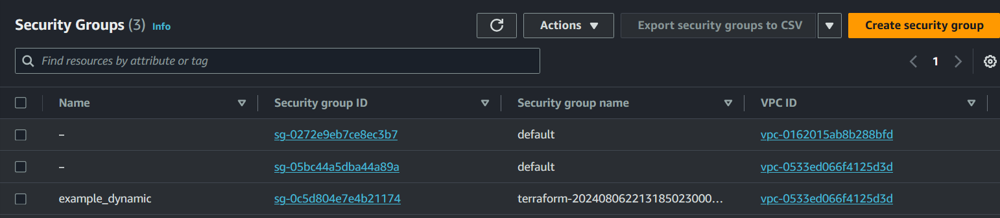
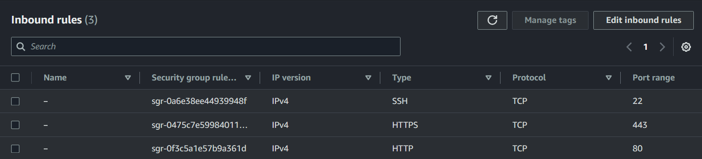
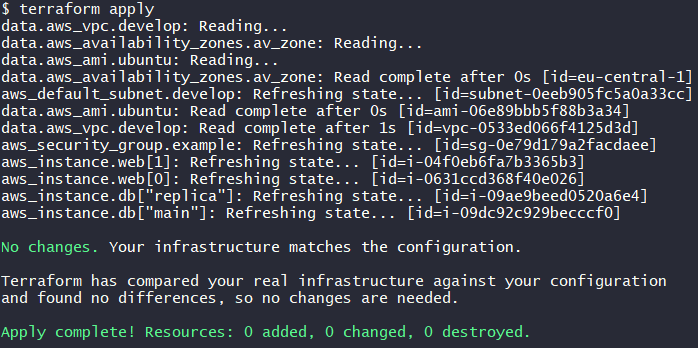
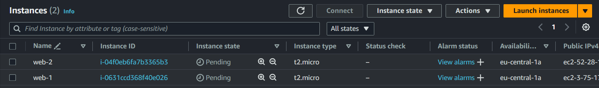
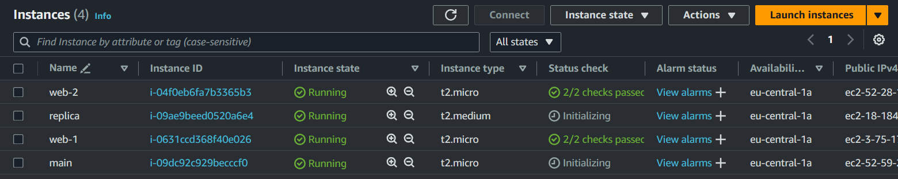

# Домашнее задание к занятию «Управляющие конструкции в коде Terraform» - Михалёв Сергей

Так как геополитическая ситуация в мире нестабильна, данное домашнее задание выполнено на платформе Amazon AWS.

<image src="https://encrypted-tbn0.gstatic.com/images?q=tbn:ANd9GcTJEZ8qzIPaSZbld6HkjbcGXg9Eb51DT5HN7aRZVQzPn2Myo93Onq7PXtWMglYnTnMqy3c&usqp=CAU)" alt="AWS"  width="100" height="auto">

------

### Задание 1

1. Изучите проект.
2. Заполните файл personal.auto.tfvars.
3. Инициализируйте проект, выполните код. Он выполнится, даже если доступа к preview нет.

Примечание. Если у вас не активирован preview-доступ к функционалу «Группы безопасности» в Yandex Cloud, запросите доступ у поддержки облачного провайдера. Обычно его выдают в течение 24-х часов.

Приложите скриншот входящих правил «Группы безопасности» в ЛК Yandex Cloud или скриншот отказа в предоставлении доступа к preview-версии.

------

**Решение**

Адаптировал код под AWS
* Segurity group *example* в спске групп</br>
  
  
* Описание правил для входящего трафика</br>
  
  
* Описание правил для исходящего трафика</br>
  

-----

### Задание 2

1. Создайте файл count-vm.tf. Опишите в нём создание двух **одинаковых** ВМ  web-1 и web-2 (не web-0 и web-1) с минимальными параметрами, используя мета-аргумент **count loop**. Назначьте ВМ созданную в первом задании группу безопасности.(как это сделать узнайте в документации провайдера yandex/compute_instance )
2. Создайте файл for_each-vm.tf. Опишите в нём создание двух ВМ для баз данных с именами "main" и "replica" **разных** по cpu/ram/disk_volume , используя мета-аргумент **for_each loop**. Используйте для обеих ВМ одну общую переменную типа:
```
variable "each_vm" {
  type = list(object({  vm_name=string, cpu=number, ram=number, disk_volume=number }))
}
```  
При желании внесите в переменную все возможные параметры.
4. ВМ из пункта 2.1 должны создаваться после создания ВМ из пункта 2.2.
5. Используйте функцию file в local-переменной для считывания ключа ~/.ssh/id_rsa.pub и его последующего использования в блоке metadata, взятому из ДЗ 2.
6. Инициализируйте проект, выполните код.

---

**Решение**
1. Создал файл [count-vm.tf](count-vm.tf) Для получения заданных имён Вм использовал выражение ```Name     = " web-${count.index + 1}"```
2. Создал файл [for_each-vm.tf](for_each-vm.tf). RAM в AWS определяется характиристиками инстанса и зависит только от его типа. Пробовал задавать различные значения переменной, но эффекта это не имело.</br>
   
3. Использовал директиву *depends_on* что бы указать порядок создания ресурсов.
   Сначала создались *web-1* и *web-2*</br>
   </br>
   затем *main* и *replica*</br>
   </br>
4. Для работы с ВМ я создал на AWS ключ, при этом получл его секретную часть. Публичная часть не доступна, только если вытащить из готовых инстансов. Таким образом, её использование в метаданных не целесообразно, достаточно занать имя ключа. Однако, если ьы это было не так, то для чтения публичного ключа я бы использовал локальную переменную 
```
locals {
  ssh_key = file("~/.ssh/id_rsa.pub")
}
```
